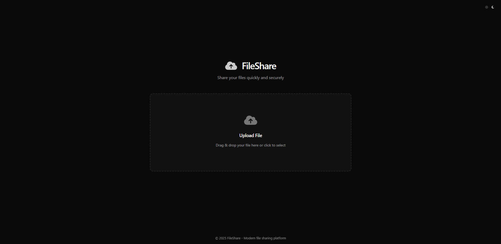

# Interface



## Features

- Drag & drop file uploads
- Password protection for files
- Automatic file expiration (1h, 6h, 24h, 72h)
- Short shareable URLs
- Dark and light theme support
- Multiple database backends (SQLite, MySQL, PostgreSQL, MongoDB)
- Single-use download links
- Mobile responsive design

## Database Support

| Database | Setup Required | Best For |
|----------|----------------|----------|
| SQLite | No | Development, small deployments |
| MySQL | Yes | Production, shared hosting |
| PostgreSQL | Yes | Production, advanced features |
| MongoDB | Yes | NoSQL, document storage |

## Installation

### Interactive Setup

```bash
npm install
node setup.js
```

The setup script will guide you through database selection and configuration.

### Manual Setup

1. Install dependencies:
```bash
npm install
```

2. Choose and install database:
```bash
# SQLite (default)
npm install sqlite3

# MySQL
npm install mysql2

# PostgreSQL
npm install pg

# MongoDB
npm install mongoose
```

3. Configure environment:
```bash
cp templates/sqlite.env .env
# Edit .env with your settings
```

4. Run migrations:
```bash
node migrate.js up
```

## Configuration

Create a `.env` file:

```env
# Database
DB_TYPE=sqlite
DB_PATH=./data/fileshare.db

# Server
PORT=3000

# Security
SESSION_SECRET=your_secret_key

# File Storage
MAX_FILE_SIZE=52428800
```

## Scripts

```bash
npm start          # Start server
npm run dev        # Development with auto-reload
npm run setup      # Interactive setup
npm run migrate    # Run database migrations
```

## API

- `GET /` - Upload page
- `POST /upload` - Upload endpoint
- `GET /:id` - Download page
- `GET /uploads/:file` - Direct download
- `GET /files` - List files

## Tech Stack

- Backend: Node.js, Express
- Database: SQLite/MySQL/PostgreSQL/MongoDB
- Frontend: Vanilla JavaScript, CSS3
- Storage: Local filesystem
- Security: bcrypt, session management

## License

MIT License - see [LICENSE](LICENSE) file for details.
